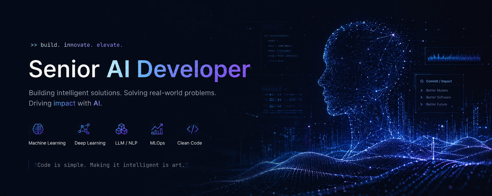

  

<h1 align="center">🧠 Hello, I'm Leo JH</h1>

  <strong>Senior AI Developer</strong> 
  <em>"Engineering intelligent multi-agent ecosystems, distributed networks, and enterprise-grade codebases."</em>

  
  

---

### 🔭 Core Architecture & Focus Areas

* **AI-Driven Engineering:** Designing sophisticated Multi-Agent orchestration pipelines, advanced Retrieval-Augmented Generation (RAG) models, and seamlessly optimizing autonomous AI workflows into modern web layers.
* **Scalable Microservices & Monorepos:** Managing large-scale enterprise codebases using **Nx Monorepos**, establishing robust microservice communication via NestJS, GraphQL, and building high-performance search systems with Elasticsearch.
* **Next-Gen Web3 Infrastructure:** Architecting secure Smart Contracts (Solidity), designing sustainable Tokenomics, and delivering full-cycle engineering for decentralized finance (DeFi) systems, DEXs, and custom NFT Marketplaces.

---

### 🛠 Technical Deep Dive (Tech Stack)

  <!-- AI & Intelligence -->
  
  
  
  
   
  <!-- Web3 & Decentralized -->
  
  
  
  
   
  <!-- Backend & Infrastructure -->
  
  
  
  
  
  
   
  <!-- Frontend & Monorepo -->
  
  
  
  
  

---

### 📊 Dynamic Insights & Metrics

  

